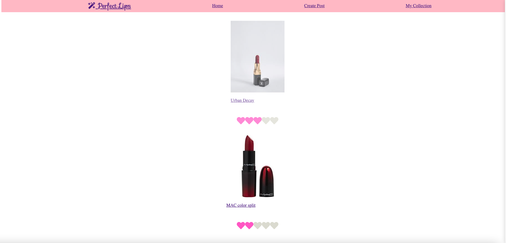
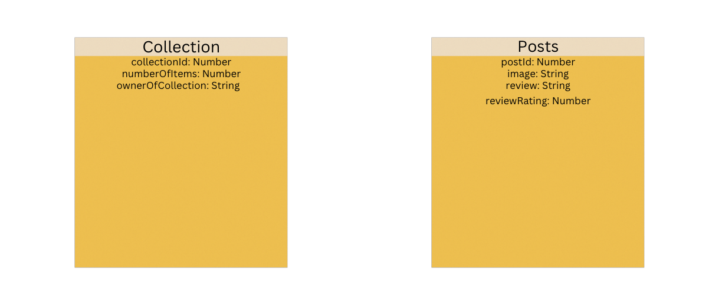

# Project Links: 

* [Frontend](https://main--reliable-fenglisu-0c642b.netlify.app/)
* [Backend](https://murmuring-lowlands-71026.herokuapp.com/)

# Project Description:

Perfect Lips is a platform where it brings lipstick connoisseurs together to talk about their most favorite subject. Fellow lipstick fans can leave reviews for various
lipsticks from any brand and can collect information from multiple users about what's worth being in their makeup collection. Once a user finds a post they deem as collection worthy, they have the option to store this post in a collection on the collection page. A post can find itself in two different collections, which are favorites or wishlist. This app is the perfect place to show off your review of lipstick products and to gain intel before walking into a store clueless about what lipstick product might be best for you. 

# Technologies Used

* React.js
* Node.js
* Mongoose.js
* Express.js
* MongoDB
* JSX
* HTML
* CSS

# Installation Instructions:

1. Fork and clone this repository.
2. Change into the new directory.
3. Install dependencies (npm i or npm install).
4. Open up your app in VS Code 
5. Run npm start to start your local server

 

# User Story: 

Viewing the homepage: 
The Home page is the first page to load for the user. The home page contains a preview of a list of posts that contain an image, name of product and rating. The user is able to hover over each post. On the home page, the user can view the navbar, which contains the home icon, create post, and a view my collection item.
If the user clicks on any of the posts listed on home page, they open to a more detailed page about that single post.

When the user clicks create post:
A page loads a form where they can input data such as: image, text, tags, and a heart rating from 1-5.
Underneath the input field the user can then press submit and be lead to a page where their post is displayed.

When the user clicks on a my collection:
A page will load a list of collections. The user can click on a collection and view all posts they added to that collection.

# Wireframe:

# ERD

# Future Upgrades:
* Ability to upload images with cloudinary
* User authentication
* User accounts
* Filtering system for review posts
